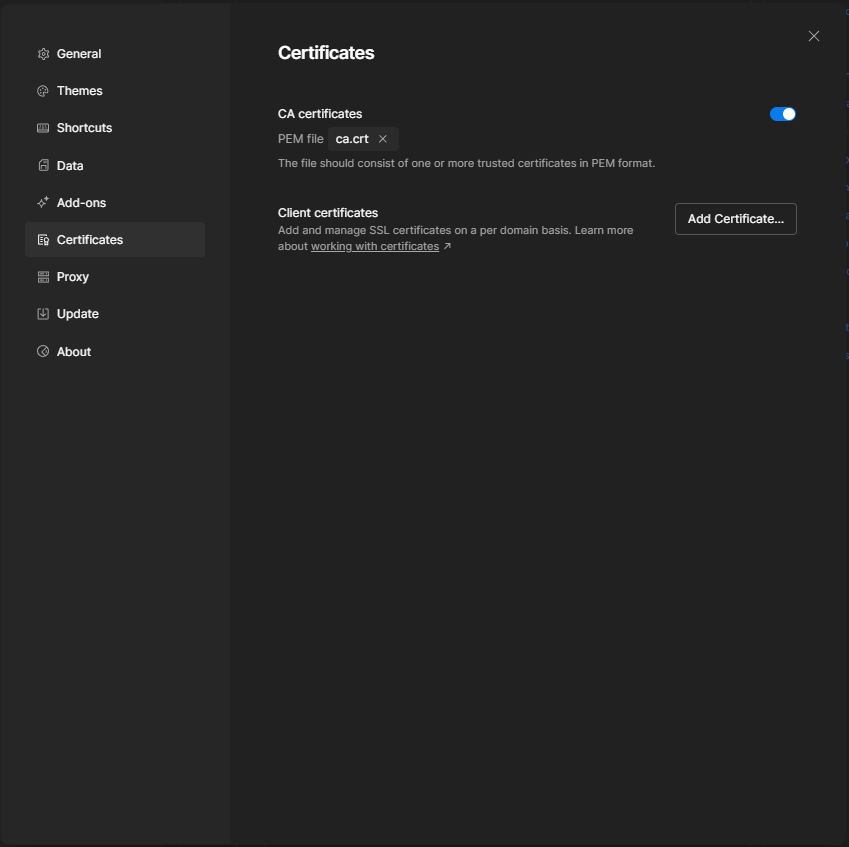

# Getting started

1. Install

    ```shell
    npm i @jrposada/pm-creds -g
    ```

2. Create config files and self-signed certificates

    ```shell
    pm-creds init
    ```

3. Start server

    ```shell
    pm-creds
    ```

    You may also use run command as a daemon

    ```shell
    pm-creds --daemon
    ```

    To stop daemon process

    ```shell
    pm-creds stop
    ```

## Install Self Signed Certificate

### Windows

1. Open Manage user certificates. Press **Windows logo key** and search **Manage user certificates**
2. Select **Trusted Root Certification Authorities** from the list.
3. Go to **Action** -> **All Tasks** -> **Import...**
4. Select `~/.pm-creds/ca.crt`

## Configure Postman

Add the next `pre-script` to postman. It will request the target AWS profile define through `aws_profile` and inject the tokens it into the request. For AWS you also need to select "AWS Signature" as auth method:


```
let profile = pm.collectionVariables.get("aws_profile");

if (!profile) {
    profile = pm.environment.get("aws_profile")
}

if (!profile) {
    throw new Error("'aws_profile' variable not set")
}

pm.sendRequest({
    url: `https://localhost:9999/aws/${profile}`,
    method: "GET",
    }, function (_, response) {
        if (response.status == "OK") {
            const body = response.json()
            pm.variables.set("aws_access_key_id", body.aws_access_key_id)
            pm.variables.set("aws_secret_access_key", body.aws_secret_access_key)
            if (body.aws_session_token) {
                pm.variables.set("aws_session_token", body.aws_session_token)
            }
            console.log(`using aws credentials from '${profile}'`)
            return
        } else {
            console.log(err)
            throw new Error(response.text() || JSON.stringify(err) || "unknown error fetching aws credentials")
        }
    }
)
```

### Postman certificates

**This step is only needed if certificates where not installed through the system.**


